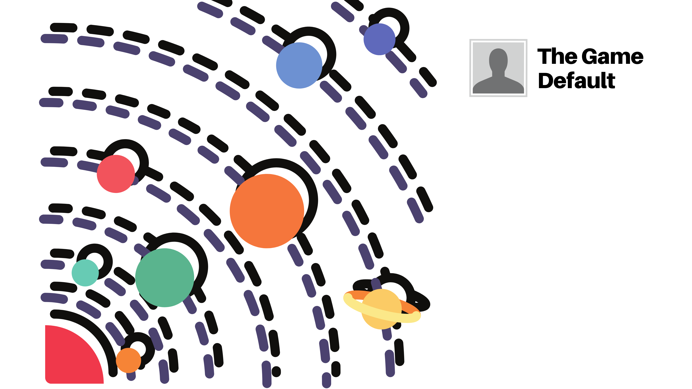
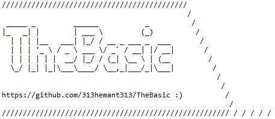
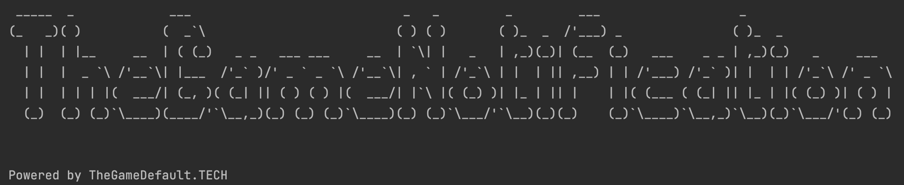

# Welcome to TheGameDefault profile

Adaptable Solution Developer with hands-on experience in Java, Python and Angular, Designing high volume distributed applications using IaaS to Server-less systems.

## Public projects

 &nbsp;
- **[TheGameMusic](https://thegamemusic.me "TheGameMusic")**: A live streaming internet radio mobile and web application. 
<a href="https://thegamemusic.me" />

&nbsp;

 
- **[TheBasic](https://github.com/313hemant313/TheBasic "TheBasic")**: A Spring boot user authentication boilerplate with S3 Image upload. 
<a href="https://github.com/313hemant313/TheBasic" />

&nbsp;

 
- **[TheGameNotification](https://github.com/313hemant313/TheGameNotification "TheGameNotification")**: A Spring boot standalone notification service with kafka consumer, AWS Pinpoint and Facebook Whatsapp api's connectors. 
<a href="https://github.com/313hemant313/TheGameNotification" />

&nbsp;

 
- **[Camunda Order Workflow](https://github.com/313hemant313/camunda-order-workflow "camunda-order-workflow")**: Camunda for microservices orchestration, In the project we have tried to cover Order processing scenario, and our main focus is on visibility/monitoring of the whole system and its configuration which could be changed in runtime.  
<a href="https://github.com/313hemant313/camunda-order-workflow" />

&nbsp;

## Ionic open source projects

  
&nbsp; &nbsp; &nbsp; &nbsp;
  

- **[Android Detect Incoming/Outgoing Calls](https://github.com/313hemant313/capacitor-plugin-incoming-call "capacitor-plugin-incoming-call")**: An ionic capacitor plugin which detects the phone states like incoming, outgoing and on-hold calls.  
- **[Android Wallpaper Manager](https://github.com/313hemant313/capacitor-plugin-wallpaper-manager "capacitor-plugin-wallpaper-manager")**: An ionic capacitor plugin to apply any wallpaper from external url.  

## Public articles

- **[Media server setup and configuration](https://thegamedefault.medium.com/create-your-own-media-streaming-platform-using-open-source-technologies-90f08138465b "Media server setup and configuration")**
- **[Audio/Video broadcasting backend development using java spring websockets](https://thegamedefault.medium.com/create-your-own-media-streaming-platform-using-open-source-technologies-part-2-e718455bd46e "Audio/Video broadcasting backend development using java spring websockets")**

## Support or Contact

- [Linkedin](https://www.linkedin.com/in/thegamedefault)
- [Twitter](https://twitter.com/thegamedefault "Twitter")
- [Upwork](https://www.upwork.com/o/profiles/users/~015098f2a3ec1561af/)
- [Email](mailto:v313hemant@gmail.com "Email")
